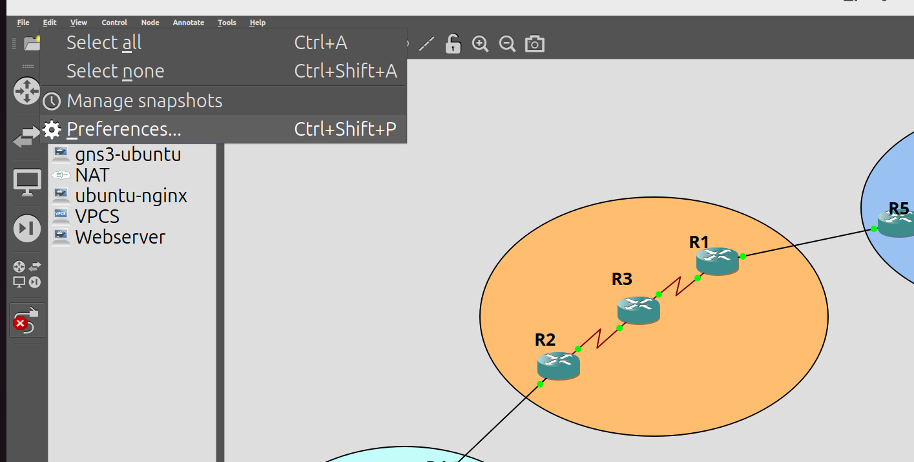
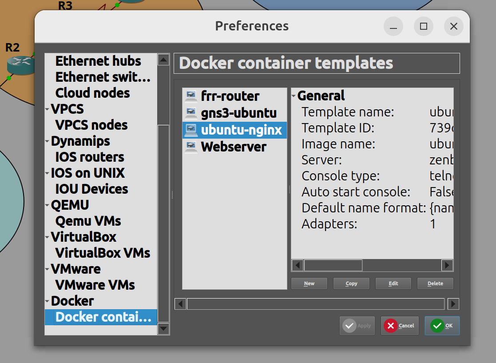
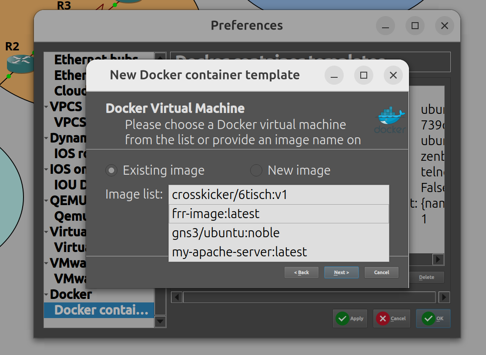
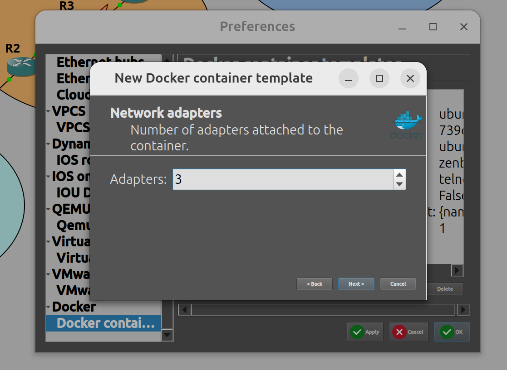
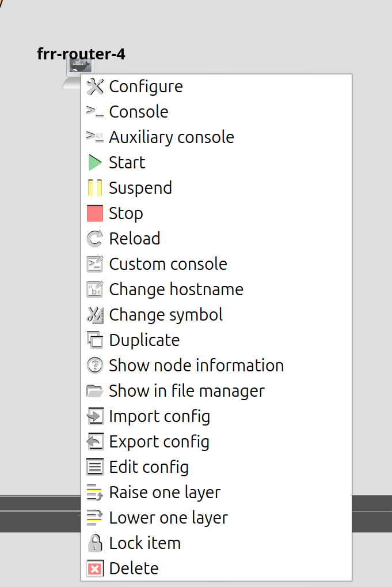
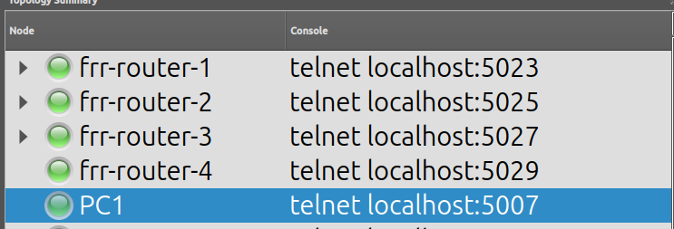

## Download GNS3

**(Skip this part if you already have GNS3)**

## Generate or Pull the image

`docker build --no-cache -t frr-image .  `

OR

`docker pull /crosskicker/frr-image:latest`

## Import in GNS3

Click on "Edit" -> Click on "Preferences" ->

Click on "Docker container" -> "New" :

Select the right image (frr-image that you downloaded) :

Select the numbers of network inerfaces : 

Just click on next until click on finish and that's it

(ESPACIALLY don't add a "Start command")

## Start the frr-router

Start your container graphically in GNS3 :

Open a terminal to configure your router (container)

ex :` telnet localhost 5029`

Run the command "vtysh" in the router CLI to start router configuration

`vtysh`
